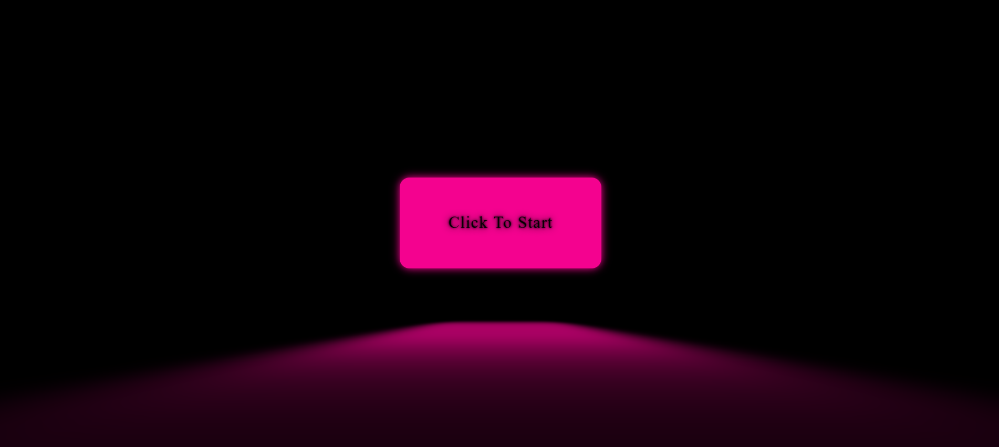

# Birthday Animation 🎂🎈

A fun and colorful birthday animation made with HTML, CSS, and JavaScript.

## 🌐 Live Demo

Check out the live site here: [https://bianca574.github.io/birthday_animation/]

## 🛠️ Technologies Used

- HTML
- CSS
- JavaScript

## 🎨 Features

- Animated birthday elements (cake, candles, "Happy Birthday!" message, confetti, etc.)
- Colorful design
- Playful motion effects
- Sounds
- Interactive start: click to begin the animation 🖱️
- Custom controls: pause, play, and restart buttons ⏯️

## 📸 Screenshot

## 📄 License

This project is closed-source. All rights reserved.
